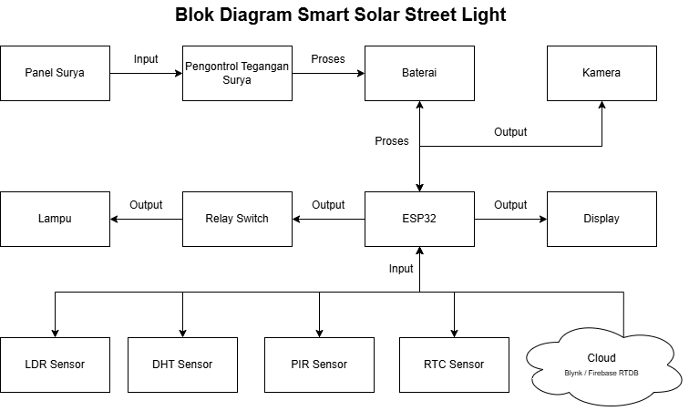
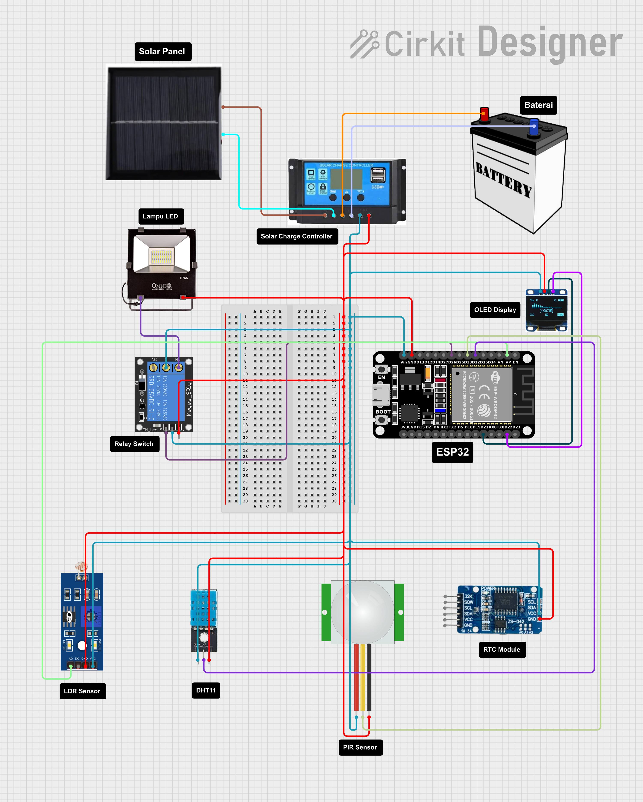

# 🌞 Smart Solar Street Light (Remote Monitor)
## 📖 Deskripsi Singkat

Smart Solar Street Light adalah sistem lampu jalan pintar berbasis energi surya yang dapat dipantau secara jarak jauh melalui platform cloud. Sistem ini bertujuan untuk menghemat energi dengan mengontrol nyala/mati lampu secara otomatis berdasarkan kondisi lingkungan dan aktivitas manusia. Tujuan Proyek ini juga guna memenuhi Tugas Besar Mata Kuliah Mikrokontroler dan IoT.

## 🎯 Tujuan
- Menghemat energi dengan mengontrol lampu jalan secara otomatis.

- Memantau status lampu secara real-time melalui platform cloud.

## 🌍 SDGs yang Disasar
✅ SDG 7 - Clean Energy
Dengan memanfaatkan energi matahari, sistem ini berkontribusi dalam transisi menuju energi terbarukan dan efisiensi energi. 

## 🚀 Fitur Utama
* Otomatisasi pengendalian lampu jalan tenaga surya.

* Pemantauan status lampu secara real-time melalui koneksi cloud.

* Ramah lingkungan dan efisien dalam penggunaan energi.

## 🧰 Komponen yang Diperlukan
### 📦 Alat
| No. | Alat                    | Fungsi                                                                 |
|-----|-------------------------|------------------------------------------------------------------------|
| 1   | ESP32                   | Mikrokontroler utama untuk kontrol sistem dan koneksi ke cloud         |
| 2   | Solar Panel             | Menghasilkan energi dari sinar matahari                                |
| 3   | Solar Charge Controller | Mengatur pengisian daya ke baterai dari panel surya                    |
| 4   | Baterai                 | Menyimpan energi untuk digunakan saat malam                            |
| 5   | Relay Switch            | Mengendalikan nyala/mati lampu LED secara elektronik                   |
| 6   | Lampu LED               | Sumber penerangan yang hemat energi                                    |
| 7   | LCD/OLED Display        | Menampilkan informasi seperti waktu, suhu, dan status sistem           |
| 8   | Kamera                  | (Opsional) Digunakan untuk pemantauan visual atau keamanan             |

### 📡 Sensor atau Modul

| No. | Sensor/Modul        | Fungsi                                                                 |
|-----|---------------------|------------------------------------------------------------------------|
| 1   | LDR                 | Mendeteksi tingkat pencahayaan lingkungan                              |
| 2   | PIR Sensor          | Mendeteksi pergerakan manusia untuk mengaktifkan lampu                 |
| 3   | DHT11 / DHT22       | Mengukur suhu dan kelembapan udara                                     |
| 4   | RTC Module          | Menyediakan waktu dan tanggal yang akurat                              |
| 5   | Cloud (Firebase / Blynk) | Platform monitoring dan kontrol jarak jauh                       |

### 📌 Cara Kerja Sistem

1. **Energi Matahari** mengisi baterai melalui **solar panel** dan **solar charge controller**.
2. **LDR** mendeteksi terang/gelap untuk menentukan waktu siang/malam.
3. **PIR sensor** mendeteksi keberadaan manusia.
4. **RTC module** memastikan waktu aktual sebagai cadangan logika waktu.
5. **DHT11/DHT22** mencatat suhu dan kelembapan lingkungan.
6. **ESP32** sebagai otak sistem mengolah data dari sensor dan mengirim ke **Cloud**.
7. **Relay Switch** mengontrol nyala/mati **lampu LED**.
8. **LCD/OLED display** menampilkan informasi lokal.
9. **Kamera (opsional)** untuk pengawasan area lampu.
    
## 🧩 Diagram Blok Sistem

  

Sistem Smart Solar Street Light dimulai dari panel surya yang menangkap energi matahari dan mengubahnya menjadi listrik. Energi ini kemudian diatur oleh pengontrol tegangan surya sebelum disimpan ke dalam baterai sebagai sumber daya utama sistem. Dari baterai, energi dialirkan ke ESP32 sebagai otak mikrokontroler yang mengelola seluruh alur kerja sistem. Berbagai sensor seperti LDR, DHT, PIR, dan RTC memberikan input ke ESP32 berupa data pencahayaan, suhu/kelembapan, pergerakan manusia, dan waktu. Berdasarkan data tersebut, ESP32 akan memutuskan kapan relay switch diaktifkan untuk menyalakan atau mematikan lampu LED. Selain itu, informasi sistem akan ditampilkan melalui display (LCD/OLED), dan dapat pula mengaktifkan kamera (opsional) untuk pemantauan visual area. Seluruh status dan data dari sistem dikirimkan secara real-time ke platform cloud (seperti Blynk atau Firebase RTDB) untuk memungkinkan pemantauan jarak jauh dan kontrol sistem secara efisien.

## 💥Desain Sistem UI/UX
### 📱 Software

### 💽 Hardware

  

## 📸 Demo / Ilustrasi

## 🫂 Kelompok 2
1. **105221004 | Helmi Apriando**
2. **105221027 | Mohamad Reza Pahlevi**

